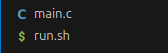
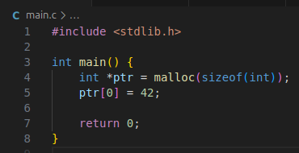
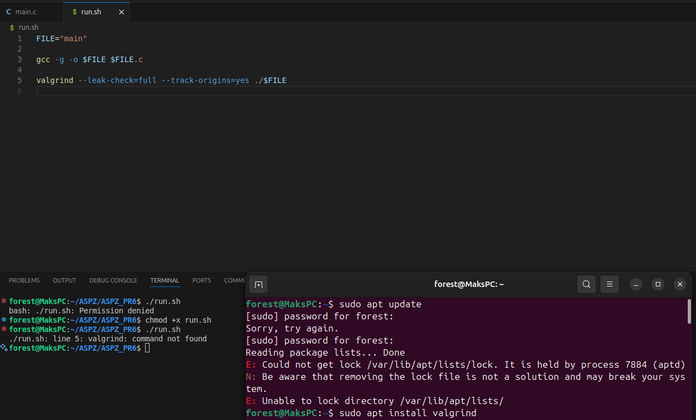
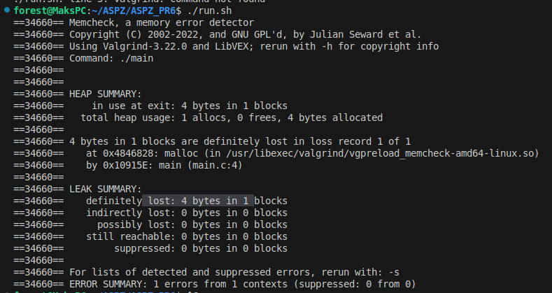

В даному проекті було створено та перевірено `bash` скрипт для запуску `Valgrind` для виявлення та перевірки витоку пам'яті в коді.

Спочатку створимо два файли, скрипт `run.sh` та код `main.c`.

Далі Напишемо простий код, за допомогою якого створимо витік пам'яті. 

Для цього достатньо виділити пам'ять для масиву за домогою `malloc` та не звільнити її після виконання за допомогою `free`.

Наступним кроком треба створити скрипт, для цього спочатку завантажуємо `valgrind` за допомогою команди `sudo apt install valgrind` на `Ubuntu`.

Після завантаження у файлі `run.sh` пишемо команди для виконання, а саме `gcc -g -o file file.c` для компіляції програми.

А потім команду `valgrind`, що буде відслідковувати не тільки витік пам'яті `--leak-check=full`, а й на якому моменті коду він виник `--track-origins=yes`.

Повна команда має вигляд: `valgrind --leak-check=full --track-origins=yes ./file`

Оскільки `run.sh` за замовчуваненям немає дозволу до запуску й видає помилку `Permission denied`, тому спочатку треба надати права доступу на виконання.

За допомогою: `chmod +x run.sh`

Після виконання всіх кроків, можна запустити скрипт `./run.sh` - це скомпілює програму та перевірить програму на витік пам'яті.

Як бачимо ми втратили 4 байти інформації в 1 блоці у файлі `main.c` на 4 рядку коду, де в нас і було виділення пам'яті за допомогою `malloc`.
